# Laporan Pembuatan Aplikasi Data Pegawai dengan Struktur Organisasi Tree & Sistem Absensi

## 1. Anggota Kelompok

Nama : Rahmat Ahdaf Albariza      /103112430003

Nama : Fa'iq Jagadhita Hardiana   /103112430015

Nama : Arzaqi Fatih Muttaqin      /103112430092

Kelas : 12-IF-05


## 2. Latar Belakang
Aplikasi Data Pegawai dengan Struktur Organisasi Tree & Sistem Absensi ini adalah untuk membantu pengelolaan data pegawai agar lebih rapi, terstruktur, dan mudah diakses. Dalam aplikasi ini, data pegawai disusun menggunakan binary tree agar penyimpanan dan pencarian data dapat dilakukan secara lebih teratur. Selain itu, setiap pegawai memiliki data absensi masing-masing yang disimpan menggunakan multi linked list, sehingga satu pegawai dapat memiliki banyak catatan absensi yang saling terhubung tanpa tercampur dengan data pegawai lain.

## 3. Usecase Diagram

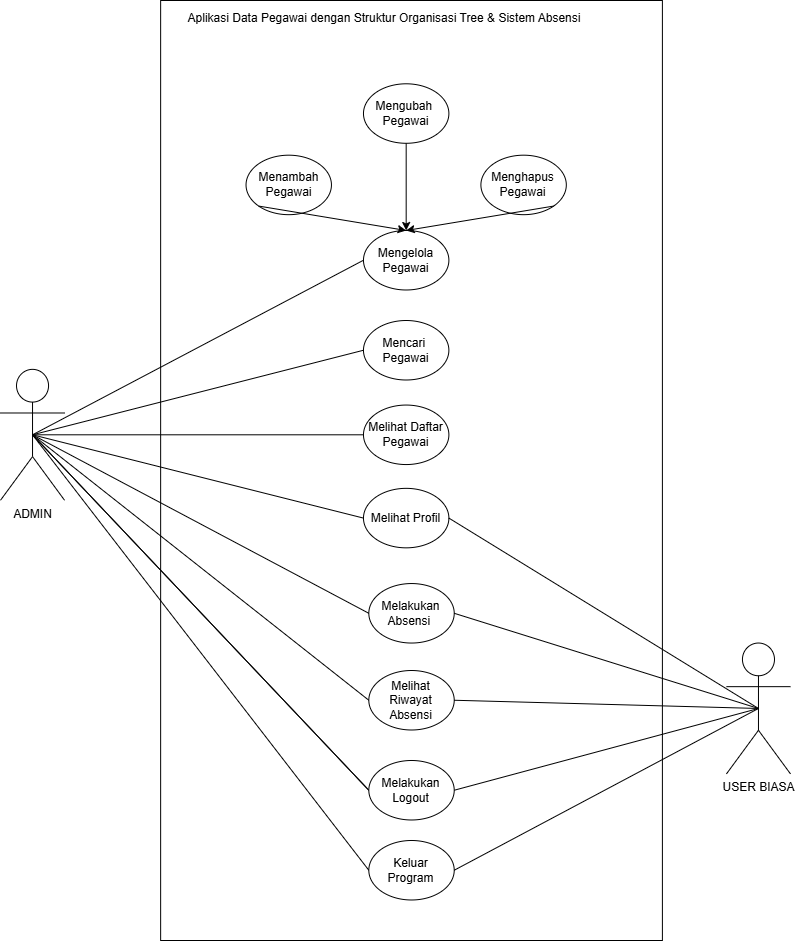

Penjelasan :

Actor :
Admin & User Biasa

Usecase :
ada 11 Usecase dimana yang bisa diakses oleh kedua aktor itu ada melihat profil, melakukkan absensi, melihat riwayat absensi, melakukan Logout, dan keluar program . Sementara usecase yang hanya bisa di akses oleh admin itu ada melihat daftar pegawai, mencari pegawai, mengelola pegawai dimana di dalam mengelola pegawai bisa tambah pegawai, ubah pegawai, dan hapus pegawai.

## 4. Pembagian Tugas
### 4.1 Tugas yang dikerjakan bersama
- seluruh isi file tubes.h atau headernya dikerjakan bersama
- seluruh isi file main.cpp dikerjakan bersama
- usecase diagram dikerjakan bersama
- laporan dikerjakan bersama

### 4.2 Tugas yang dikerjakan oleh Rahmat Ahdaf Albariza di file tubes.cpp
- Membuat fungsi void inorderBST
- Membuat fungsi adrPegawai findMin
- Membuat fungsi adrPegawai hapusPegawai
- Membuat fungsi void hapusPegawai
- Membuat fungsi void cariPegawai
- Membuat fungsi void saveCSVHelper dan void saveCSV

### 4.3 Tugas yang dikerjakan oleh Fa'iq Jagadhita Hardiana di file tubes.cpp
- Membuat fungsi void tambahPegawai
- Membuat fungsi void ubahPegawai
- Membuat fungsi void tambahAbsensi
- Membuat fungsi void tampilAbsensi
- Membuat fungsi void loadCSV

### 4.4 Tugas yang dikerjakan oleh Arzaqi Fatih Muttaqin di file tubes.cpp
- Membuat fungsi adrPegawai createPegawai
- Membuat fungsi void insertBST
- Membuat fungsi adrPegawai searchBST

## 5. Kesuliatan Selama Mengerjakan Tugas Besar
- Komunikasi Antar Anggota
  jadi karena banyaknya hari libur dan banyak yang pulang ke rumah masing-masing membuat komunikasi kami dalam mengerjakan tubes kurang baik.
- Database CSV
  Membaca dan menyimpan data absensi pegawai dari/ke CSV dengan format yang konsisten cukup sulit, karena baru pertama kali.

## 6. Program/Codingan
### 6.1 tubes.h
```cpp
#ifndef TUBES_H
#define TUBES_H

#include <iostream>
#include <string>
using namespace std;

// ABSENSI(Multi Linked List(satutingkat/one-to-many))
struct Absensi {
    string tanggal;
    string jamMasuk;
    Absensi* next;
};

// Pegawai (BST)
struct Pegawai {
    int id;
    string nama;
    string jabatan;
    string role;
    Absensi* firstAbsensi;
    Pegawai* left;
    Pegawai* right;
};

typedef Pegawai* adrPegawai;

// BST
adrPegawai createPegawai(int id, string nama, string jabatan, string role);
void insertBST(adrPegawai& root, adrPegawai p);
adrPegawai searchBST(adrPegawai root, int id);
void inorderBST(adrPegawai root);

// khusus admin
void tambahPegawai(adrPegawai& root);
void ubahPegawai(adrPegawai root);
adrPegawai findMin(adrPegawai root);
adrPegawai hapusPegawai(adrPegawai root, int id);
void hapusPegawai(adrPegawai &root);
void cariPegawai(adrPegawai root);

// ABSENSI
void tambahAbsensi(adrPegawai p, string tanggal, string jam);
void tampilAbsensi(adrPegawai p);

// FILE CSV
void loadCSV(adrPegawai& root, string filename);
void saveCSV(adrPegawai root, string filename);

#endif
```

Penjelasan : 

File tubes.h merupakan header file yang berfungsi sebagai pusat deklarasi struktur data dan prototipe fungsi yang digunakan dalam program Aplikasi Data Pegawai. Header ini dirancang untuk memisahkan antara deklarasi dan implementasi program, sehingga meningkatkan keterbacaan kode, kemudahan pemeliharaan, serta penerapan konsep modular dalam pemrograman C++.

Pada bagian awal, didefinisikan struktur Absensi yang direpresentasikan menggunakan Linked List. Struktur ini menyimpan informasi tanggal dan jam masuk pegawai, serta pointer next yang menunjuk ke data absensi berikutnya. Dengan menggunakan linked list, setiap pegawai dapat memiliki jumlah data absensi yang dinamis (tidak terbatas), sesuai dengan konsep relasi one-to-many antara pegawai dan absensi.

Struktur Pegawai merepresentasikan data utama pegawai dan diorganisasikan menggunakan Binary Search Tree (BST). Setiap node Pegawai menyimpan atribut berupa id, nama, jabatan, dan role (admin atau user), serta pointer firstAbsensi yang menunjuk ke linked list absensi milik pegawai tersebut. Selain itu, terdapat pointer left dan right yang digunakan untuk membentuk struktur BST berdasarkan id pegawai, sehingga proses pencarian, penambahan, dan penghapusan data dapat dilakukan secara efisien.

Tipe data adrPegawai didefinisikan sebagai pointer ke struktur Pegawai untuk mempermudah penulisan dan pemanggilan fungsi. Selanjutnya, dideklarasikan fungsi-fungsi dasar BST seperti createPegawai, insertBST, searchBST, dan inorderBST. Fungsi-fungsi ini digunakan untuk membuat node pegawai baru, menyisipkan data ke dalam BST, mencari pegawai berdasarkan ID, serta menampilkan data pegawai secara terurut.

Bagian khusus admin menyediakan fungsi-fungsi pengelolaan data pegawai, antara lain tambahPegawai, ubahPegawai, hapusPegawai, dan cariPegawai. Fungsi findMin digunakan sebagai pendukung dalam proses penghapusan node BST, khususnya saat menghapus node yang memiliki dua anak. Dengan adanya pemisahan fitur admin ini, sistem mampu menerapkan konsep hak akses (role-based access control) secara sederhana.

Selanjutnya, pada bagian ABSENSI, dideklarasikan fungsi tambahAbsensi dan tampilAbsensi. Fungsi tambahAbsensi digunakan untuk menambahkan data absensi baru ke linked list milik pegawai tertentu, sedangkan tampilAbsensi berfungsi untuk menampilkan seluruh riwayat absensi dari pegawai tersebut. Implementasi ini menunjukkan penggunaan kombinasi struktur data BST dan Multi Linked List (satu tingkat) dalam satu sistem.

Terakhir, bagian FILE berisi deklarasi fungsi loadCSV dan saveCSV yang digunakan untuk membaca dan menyimpan data pegawai ke dalam file CSV. Fungsi loadCSV bertugas memuat data awal pegawai dari file ke dalam BST saat program dijalankan, sedangkan saveCSV digunakan untuk menyimpan kembali data pegawai ke dalam file saat program selesai. Dengan fitur ini, data pegawai dapat disimpan secara permanen dan digunakan kembali pada eksekusi program berikutnya.

### 6.2 tubes.cpp
```cpp
#include "tubes.h"
#include <fstream>
#include <sstream>
#include <iomanip>

// create pegawai
adrPegawai createPegawai(int id, string nama, string jabatan, string role) {
    adrPegawai p = new Pegawai;
    p->id = id;
    p->nama = nama;
    p->jabatan = jabatan;
    p->role = role;
    p->firstAbsensi = NULL; // riwayat absensi awal
    p->left = p->right = NULL;
    return p;
}

// BST
void insertBST(adrPegawai& root, adrPegawai p) {
    if (!root) root = p;
    else if (p->id < root->id) insertBST(root->left, p);
    else insertBST(root->right, p);
}

adrPegawai searchBST(adrPegawai root, int id) {
    if (!root || root->id == id) return root;
    if (id < root->id) return searchBST(root->left, id);
    return searchBST(root->right, id);
}

void inorderBST(adrPegawai root) {
    if (!root) return;

    inorderBST(root->left);

    Absensi* a = root->firstAbsensi;

    if (!a) {
        cout << "| " << setw(4) << root->id
             << " | " << setw(15) << root->nama
             << " | " << setw(16) << root->jabatan
             << " | " << setw(5) << root->role
             << " | " << setw(26) << "-" << " |\n";
    } else {
        bool pertama = true;
        while (a) {
            if (pertama) {
                cout << "| " << setw(4) << root->id
                     << " | " << setw(15) << root->nama
                     << " | " << setw(16) << root->jabatan
                     << " | " << setw(5) << root->role
                     << " | " << setw(10) << a->tanggal
                     << " " << setw(10) << a->jamMasuk << " |\n";
                pertama = false;
            } else {
                cout << "| " << setw(4) << " "
                     << " | " << setw(15) << " "
                     << " | " << setw(16) << " "
                     << " | " << setw(5) << " "
                     << " | " << setw(10) << a->tanggal
                     << " " << setw(10) << a->jamMasuk << " |\n";
            }
            a = a->next;
        }
    }

    cout << "---------------------------------------------------------------------------------\n";

    inorderBST(root->right);
}

// Khusus Untuk Admin
void tambahPegawai(adrPegawai& root) {
    int id;
    string nama, jabatan, role;
    char pilih;

    while (true) {
        cout << "ID Pegawai: ";
        cin >> id;

        if (searchBST(root, id)) {
            cout << "ID sudah terpakai!\n";
            cout << "Masukkan ID lagi? (y/n): ";
            cin >> pilih;

            if (pilih == 'n' || pilih == 'N')
                return;
        } else {
            break;
        }
    }

    cin.ignore();
    cout << "Nama Pegawai: ";
    getline(cin, nama);

    bool adaDirektur;
    do {
        adaDirektur = false;
        cout << "Jabatan: ";
        getline(cin, jabatan);

        if (jabatan == "Direktur Utama") {
            adrPegawai stack[100];
            int top = -1;
            adrPegawai curr = root;

            while (curr || top != -1) {
                while (curr) {
                    stack[++top] = curr;
                    curr = curr->left;
                }
                curr = stack[top--];

                if (curr->jabatan == "Direktur Utama") {
                    adaDirektur = true;
                    break;
                }
                curr = curr->right;
            }

            if (adaDirektur) {
                cout << "Direktur Utama sudah ada!\n";
                cout << "Masukkan jabatan lagi? (y/n): ";
                cin >> pilih;
                cin.ignore();

                if (pilih == 'n' || pilih == 'N')
                    return;
            }
        }

    } while (jabatan == "Direktur Utama" && adaDirektur);

    cout << "Role (admin/user biasa): ";
    getline(cin, role);

    adrPegawai p = createPegawai(id, nama, jabatan, role);
    insertBST(root, p);

    cout << "Pegawai berhasil ditambahkan!\n";
}

void ubahPegawai(adrPegawai root) {
    int id, pilihMenu;
    adrPegawai p;
    char pilih;

    while (true) {
        cout << "Masukkan ID Pegawai: ";
        cin >> id;

        p = searchBST(root, id);
        if (!p) {
            cout << "ID tidak ada!\n";
            cout << "Masukkan ID lagi? (y/n): ";
            cin >> pilih;

            if (pilih == 'n' || pilih == 'N')
                return;
        } else {
            break;
        }
    }

    cin.ignore();

    bool selesai = false;
    while (!selesai) {
        cout << "\n===== MENU UBAH DATA PEGAWAI =====\n";
        cout << "1. Ubah Nama\n";
        cout << "2. Ubah Jabatan\n";
        cout << "3. Ubah Role\n";
        cout << "4. Selesai\n";
        cout << "Pilih: ";
        cin >> pilihMenu;
        cin.ignore();

        switch (pilihMenu) {
        case 1:
            cout << "Nama Baru: ";
            getline(cin, p->nama);
            cout << "Nama berhasil diubah!\n";
            break;

        case 2: {
            bool valid = false;
            while (!valid) {
                string jabatanBaru;
                cout << "Jabatan Baru: ";
                getline(cin, jabatanBaru);
                if (jabatanBaru == "Direktur Utama") {
                    // Cek apakah sudah ada Direktur Utama selain p
                    bool adaDirektur = false;
                    adrPegawai stack[100];
                    int top = -1;
                    adrPegawai curr = root;

                    while (curr || top != -1) {
                        while (curr) {
                            stack[++top] = curr;
                            curr = curr->left;
                        }
                        curr = stack[top--];

                        if (curr != p && curr->jabatan == "Direktur Utama") {
                            adaDirektur = true;
                            break;
                        }
                        curr = curr->right;
                    }
                    if (adaDirektur) {
                        cout << "Gagal! Sudah ada Direktur Utama lain.\n";
                        cout << "Masukkan jabatan lagi!\n";
                        continue; // suruh input ulang jabatan
                    }
                }

                // Jika lolos cek, ubah jabatan
                p->jabatan = jabatanBaru;
                cout << "Jabatan berhasil diubah!\n";
                valid = true;
            }
            break;
        }


        case 3:
            cout << "Role Baru (admin/user biasa): ";
            getline(cin, p->role);
            cout << "Role berhasil diubah!\n";
            break;

        case 4:
            selesai = true;
            cout << "Selesai mengubah data pegawai.\n";
            break;

        default:
            cout << "Pilihan tidak valid!\n";
        }
    }
}

adrPegawai findMin(adrPegawai root) {
    while (root->left) root = root->left;
    return root;
}

adrPegawai hapusPegawai(adrPegawai root, int id) {
    if (!root) return root;

    if (id < root->id)
        root->left = hapusPegawai(root->left, id);
    else if (id > root->id)
        root->right = hapusPegawai(root->right, id);
    else {
        if (!root->left) {
            adrPegawai temp = root->right;
            delete root;
            return temp;
        }
        if (!root->right) {
            adrPegawai temp = root->left;
            delete root;
            return temp;
        }

        adrPegawai temp = findMin(root->right);
        root->id = temp->id;
        root->nama = temp->nama;
        root->jabatan = temp->jabatan;
        root->role = temp->role;
        root->right = hapusPegawai(root->right, temp->id);
    }
    return root;
}

void hapusPegawai(adrPegawai &root) {
    int id;
    adrPegawai cek;
    char pilih;

    while (true) {
        cout << "Masukkan ID Pegawai yang akan dihapus: ";
        cin >> id;

        cek = searchBST(root, id);
        if (!cek) {
            cout << "ID tidak ada!\n";
            cout << "Coba lagi? (y/n): ";
            cin >> pilih;

            if (pilih == 'n' || pilih == 'N')
                return;
        } else {
            break;
        }
    }

    root = hapusPegawai(root, id);
    cout << "Pegawai berhasil dihapus.\n";
}

void cariPegawai(adrPegawai root) {
    int id;
    adrPegawai p;
    char pilih;

    while (true) {
        cout << "Masukkan ID Pegawai: ";
        cin >> id;

        p = searchBST(root, id);
        if (!p) {
            cout << "ID tidak ada!\n";
            cout << "Cari lagi? (y/n): ";
            cin >> pilih;

            if (pilih == 'n' || pilih == 'N')
                return;
        } else {
            break;
        }
    }

    cout << "\n===== DATA PEGAWAI =====\n";
    cout << "ID      : " << p->id << endl;
    cout << "Nama    : " << p->nama << endl;
    cout << "Jabatan : " << p->jabatan << endl;
    cout << "Role    : " << p->role << endl;

    cout << "\n===== RIWAYAT ABSENSI =====\n";

    if (p->firstAbsensi == NULL) {
        cout << "Belum ada riwayat absensi.\n";
    } else {
        Absensi* a = p->firstAbsensi;
        int no = 1;
        while (a) {
            cout << no++ << ". "
                 << a->tanggal << " | "
                 << a->jamMasuk << endl;
            a = a->next;
        }
    }
}

// Menambahkan Absensi
void tambahAbsensi(adrPegawai p, string tanggal, string jam) {
    Absensi* a = new Absensi;
    a->tanggal = tanggal;
    a->jamMasuk = jam;
    a->next = NULL;

    if (!p->firstAbsensi) {
        // Jika belum ada absensi sama sekali
        p->firstAbsensi = a;
    } else {
        // Cari node terakhir
        Absensi* curr = p->firstAbsensi;
        while (curr->next) {
            curr = curr->next;
        }
        // Tambahkan di akhir
        curr->next = a;
    }
}

void tampilAbsensi(adrPegawai p) {
    Absensi* a = p->firstAbsensi;
    if (!a) {
        cout << "Belum ada absensi.\n";
        return;
    }
    while (a) {
        cout << a->tanggal << " | " << a->jamMasuk << endl;
        a = a->next;
    }
}

// memuat data pegawai dan absensi 
void loadCSV(adrPegawai& root, string filename) {
    ifstream file(filename);
    string line;

    while (getline(file, line)) {
        stringstream ss(line);
        string id, nama, jabatan, role, tanggal, jam;

        getline(ss, id, ',');
        getline(ss, nama, ',');
        getline(ss, jabatan, ',');
        getline(ss, role, ',');
        getline(ss, tanggal, ',');
        getline(ss, jam, ',');

        // Cari pegawai di BST
        adrPegawai p = searchBST(root, stoi(id));
        if (!p) {
            p = createPegawai(stoi(id), nama, jabatan, role);
            insertBST(root, p);
        }

        // Tambahkan absensi di akhir linked list
        if (tanggal != "-" && jam != "-") {
            Absensi* a = new Absensi;
            a->tanggal = tanggal;
            a->jamMasuk = jam;
            a->next = NULL;

            if (!p->firstAbsensi) {
                p->firstAbsensi = a;
            } else {
                Absensi* curr = p->firstAbsensi;
                while (curr->next) curr = curr->next;
                curr->next = a;
            }
        }
    }

    file.close();
}

// menyimpan data ke file csv
void saveCSVHelper(adrPegawai root, ofstream& file) {
    if (!root) return;

    saveCSVHelper(root->left, file);

    Absensi* a = root->firstAbsensi;
    if (!a)
        file << root->id << "," << root->nama << "," << root->jabatan
             << "," << root->role << ",-,\n";
    else
        while (a) {
            file << root->id << "," << root->nama << "," << root->jabatan
                 << "," << root->role << "," << a->tanggal << "," << a->jamMasuk << "\n";
            a = a->next;
        }

    saveCSVHelper(root->right, file);
}

void saveCSV(adrPegawai root, string filename) {
    ofstream file(filename);
    saveCSVHelper(root, file);
    file.close();
}
```

penjelasan : 

File tubes.cpp merupakan berkas implementasi dari seluruh fungsi yang telah dideklarasikan pada file header tubes.h. File ini berperan sebagai inti logika program Aplikasi Data Pegawai yang mengintegrasikan struktur data Binary Search Tree (BST) untuk manajemen pegawai dan Multi Linked List (satu tingkat)(one-to-many) untuk pencatatan absensi. Implementasi pada file ini dirancang agar setiap operasi pengelolaan data dapat dilakukan secara efisien, terstruktur, dan sesuai dengan konsep dasar struktur data.

Fungsi createPegawai digunakan untuk membuat node pegawai baru. Fungsi ini mengalokasikan memori secara dinamis dan menginisialisasi seluruh atribut pegawai, termasuk ID, nama, jabatan, role, serta pointer firstAbsensi yang diset bernilai NULL sebagai penanda bahwa pegawai tersebut belum memiliki riwayat absensi. Pointer left dan right juga diinisialisasi NULL untuk membentuk struktur BST.

Operasi dasar BST diimplementasikan melalui fungsi insertBST, searchBST, dan inorderBST. Fungsi insertBST menyisipkan node pegawai ke dalam BST berdasarkan ID pegawai sebagai key, sehingga data tersusun secara terurut. Fungsi searchBST digunakan untuk mencari data pegawai secara rekursif dengan kompleksitas waktu yang efisien. Sementara itu, fungsi inorderBST melakukan traversal inorder untuk menampilkan seluruh data pegawai secara terurut berdasarkan ID, sekaligus menampilkan seluruh riwayat absensi yang dimiliki oleh setiap pegawai.

Bagian khusus admin mencakup fungsi-fungsi pengelolaan data pegawai seperti tambahPegawai, ubahPegawai, hapusPegawai, dan cariPegawai. Fungsi tambahPegawai memastikan bahwa ID pegawai bersifat unik dan menerapkan aturan organisasi, yaitu hanya boleh terdapat satu pegawai dengan jabatan Direktur Utama. Fungsi ubahPegawai memungkinkan admin untuk memperbarui data nama, jabatan, dan role pegawai, dengan validasi khusus pada perubahan jabatan Direktur Utama agar tidak terjadi duplikasi. Fungsi hapusPegawai mengimplementasikan penghapusan node BST dengan mempertimbangkan tiga kondisi, yaitu node tanpa anak, satu anak, atau dua anak, dengan memanfaatkan fungsi findMin sebagai pendukung.

Fungsi cariPegawai digunakan untuk menampilkan detail informasi pegawai tertentu berdasarkan ID, termasuk riwayat absensi yang tersimpan dalam linked list. Dengan fitur ini, pengguna dapat melihat data pegawai secara spesifik tanpa harus menampilkan seluruh isi BST.

Pengelolaan absensi diimplementasikan melalui fungsi tambahAbsensi dan tampilAbsensi. Setiap absensi disimpan sebagai node pada linked list yang terhubung langsung dengan data pegawai terkait. Penambahan absensi dilakukan di bagian akhir linked list untuk menjaga urutan kronologis berdasarkan waktu pencatatan. Pendekatan ini mencerminkan relasi one-to-many antara pegawai dan absensi, di mana satu pegawai dapat memiliki banyak data absensi.

Fungsi loadCSV digunakan untuk memuat data pegawai dan absensi dari file CSV ke dalam struktur BST saat program dijalankan. Pada proses ini, program akan memeriksa apakah data pegawai sudah ada di dalam BST; jika belum, maka data pegawai akan dibuat terlebih dahulu sebelum absensi ditambahkan. Dengan cara ini, integritas data antara pegawai dan absensinya tetap terjaga.

Proses penyimpanan data ke dalam file CSV diimplementasikan melalui fungsi saveCSV dan saveCSVHelper. Fungsi saveCSVHelper melakukan traversal inorder pada BST untuk memastikan data disimpan secara terurut, kemudian menuliskan setiap data pegawai beserta riwayat absensinya ke dalam file CSV. Jika seorang pegawai belum memiliki absensi, maka simbol “-” digunakan sebagai penanda. Mekanisme ini memungkinkan data disimpan secara permanen dan dapat digunakan kembali pada eksekusi program berikutnya.

Secara keseluruhan, file tubes.cpp menunjukkan penerapan kombinasi struktur data BST dan Multi Linked List (satu tingkat)(one-to-many) dalam satu sistem yang saling terintegrasi. Implementasi ini tidak hanya mendukung efisiensi pengelolaan data pegawai dan absensi, tetapi juga mencerminkan penerapan konsep modularitas, validasi data, serta pengelolaan memori dinamis dalam pemrograman C++.

### 6.3 main.cpp
```cpp
#include "tubes.h"

int main() {
    adrPegawai root = NULL;
    loadCSV(root, "data_pegawai.csv");

    bool programJalan = true;

    while (programJalan) {
        int idLogin;
        cout << "\n===== LOGIN PEGAWAI =====\n";
        cout << "Masukkan ID Pegawai (0 untuk keluar): ";
        cin >> idLogin;

        if (idLogin == 0) {
            cout << "Keluar dari program...\n";
            break;
        }

        adrPegawai user = searchBST(root, idLogin);
        if (!user) {
            cout << "ID tidak ditemukan!\n";
            continue;
        }

        bool loginAktif = true;

        // MENU ADMIN 
        if (user->role == "admin") {
            while (loginAktif) {
                int pilih;
                cout << "\n===== MENU ADMIN =====\n";
                cout << "1. Lihat Profil Saya\n";
                cout << "2. Lihat Daftar Pegawai\n";
                cout << "3. Absensi Masuk\n";
                cout << "4. Riwayat Absensi\n";
                cout << "5. Kelola Pegawai\n";
                cout << "6. Cari Pegawai\n";
                cout << "7. Logout Akun\n";
                cout << "8. Keluar Program\n";
                cout << "Pilih: ";
                cin >> pilih;

                switch (pilih) {
                case 1:
                    cout << "\nID: " << user->id
                         << "\nNama: " << user->nama
                         << "\nJabatan: " << user->jabatan
                         << "\nRole: " << user->role << endl;
                    break;

                case 2:
                    cout << "=================================================================================\n";
                    cout << "| ID   | Nama            | Jabatan           | Role  | Riwayat Absensi            |\n";
                    cout << "=================================================================================\n";
                    inorderBST(root);
                    break;

                case 3: {
                    string tanggal, jam;
                    cin.ignore();

                    cout << "Masukkan Tanggal (YYYY-MM-DD): ";
                    getline(cin, tanggal);

                    cout << "Masukkan Jam Masuk (HH:MM): ";
                    getline(cin, jam);

                    tambahAbsensi(user, tanggal, jam);
                    saveCSV(root, "data_pegawai.csv");
                    cout << "Absensi berhasil!\n";
                    break;
                }

                case 4:
                    tampilAbsensi(user);
                    break;

                case 5: { // KELOLA PEGAWAI
                    bool kelola = true;
                    while (kelola) {
                        int kp;
                        cout << "\n===== KELOLA PEGAWAI =====\n";
                        cout << "1. Tambah Pegawai\n";
                        cout << "2. Ubah Pegawai\n";
                        cout << "3. Hapus Pegawai\n";
                        cout << "4. Kembali ke Menu Admin\n";
                        cout << "Pilih: ";
                        cin >> kp;

                        switch (kp) {
                        case 1:
                            tambahPegawai(root);
                            saveCSV(root, "data_pegawai.csv");
                            break;

                        case 2:
                            ubahPegawai(root);
                            saveCSV(root, "data_pegawai.csv");
                            break;

                        case 3:
                            hapusPegawai(root);
                            saveCSV(root, "data_pegawai.csv");
                            break;

                        case 4:
                            kelola = false;
                            break;

                        default:
                            cout << "Pilihan tidak valid!\n";
                        }
                    }
                    break;
                }

                case 6:
                    cariPegawai(root);
                    saveCSV(root, "data_pegawai.csv");
                    break;

                case 7:
                    cout << "Logout akun...\n";
                    loginAktif = false;
                    break;

                case 8:
                    cout << "Keluar dari program...\n";
                    loginAktif = false;
                    programJalan = false;
                    break;

                default:
                    cout << "Pilihan tidak valid!\n";
                }
            }
        }

        // MENU USER BIASA
        else {
            while (loginAktif) {
                int pilih;
                cout << "\n===== MENU USER BIASA =====\n";
                cout << "1. Lihat Profil Saya\n";
                cout << "2. Absensi Masuk\n";
                cout << "3. Riwayat Absensi\n";
                cout << "4. Logout Akun\n";
                cout << "5. Keluar Program\n";
                cout << "Pilih: ";
                cin >> pilih;

                switch (pilih) {
                case 1:
                    cout << "\nID: " << user->id
                         << "\nNama: " << user->nama
                         << "\nJabatan: " << user->jabatan
                         << "\nRole: " << user->role << endl;
                    break;

                case 2: {
                    string tanggal, jam;
                    cin.ignore();

                    cout << "Masukkan Tanggal (YYYY-MM-DD): ";
                    getline(cin, tanggal);

                    cout << "Masukkan Jam Masuk (HH:MM): ";
                    getline(cin, jam);

                    tambahAbsensi(user, tanggal, jam);
                    saveCSV(root, "data_pegawai.csv");
                    cout << "Absensi berhasil!\n";
                    break;
                }

                case 3:
                    tampilAbsensi(user);
                    break;

                case 4:
                    cout << "Logout akun...\n";
                    loginAktif = false;
                    break;

                case 5:
                    cout << "Keluar dari program...\n";
                    loginAktif = false;
                    programJalan = false;
                    break;

                default:
                    cout << "Pilihan tidak valid!\n";
                }
            }
        }
    }

    saveCSV(root, "data_pegawai.csv");
    return 0;
}
```

Penjelasan : 

File main.cpp merupakan titik masuk (entry point) dari program Aplikasi Data Pegawai. Pada bagian awal program, variabel root diinisialisasi sebagai NULL untuk menandakan bahwa struktur Binary Search Tree (BST) masih kosong. Selanjutnya, fungsi loadCSV dipanggil untuk memuat seluruh data pegawai dan absensi dari file data_pegawai.csv ke dalam BST, sehingga data yang tersimpan sebelumnya dapat langsung digunakan saat program dijalankan.

Program kemudian berjalan di dalam sebuah loop utama yang memungkinkan sistem menerima beberapa sesi login secara berurutan tanpa harus menutup aplikasi. Proses login dilakukan dengan meminta pengguna memasukkan ID pegawai. Jika ID yang dimasukkan bernilai nol, maka program akan berhenti. Validasi ID dilakukan menggunakan fungsi searchBST, sehingga hanya pegawai yang terdaftar dalam sistem yang dapat mengakses fitur program.

Setelah proses login berhasil, sistem akan membedakan hak akses pengguna berdasarkan atribut role. Apabila role pegawai adalah admin, maka pengguna akan diarahkan ke menu admin. Menu ini menyediakan fitur-fitur lengkap, seperti melihat profil pribadi, menampilkan seluruh data pegawai melalui traversal inorder BST, melakukan absensi masuk, melihat riwayat absensi, mengelola data pegawai (tambah, ubah, dan hapus), serta mencari data pegawai tertentu. Setiap perubahan data yang dilakukan oleh admin akan langsung disimpan ke dalam file CSV untuk menjaga konsistensi dan keutuhan data.

Fitur absensi masuk memungkinkan admin maupun user biasa untuk mencatat kehadiran dengan memasukkan tanggal dan jam masuk. Data absensi ini kemudian ditambahkan ke linked list absensi milik pegawai yang sedang login melalui fungsi tambahAbsensi. Setelah absensi berhasil dicatat, fungsi saveCSV dipanggil agar data tersebut tersimpan secara permanen.

Pada menu admin, fitur kelola pegawai diimplementasikan menggunakan submenu tersendiri yang memisahkan operasi tambah, ubah, dan hapus data pegawai. Pendekatan ini bertujuan untuk meningkatkan keterbacaan alur program serta memudahkan pengguna dalam mengelola data. Selain itu, admin juga diberikan fitur pencarian pegawai berdasarkan ID untuk menampilkan data secara spesifik tanpa harus menelusuri seluruh BST.

Apabila pegawai yang login memiliki role user biasa, maka sistem hanya menampilkan menu dengan hak akses terbatas. User biasa hanya diperbolehkan melihat profil pribadi, melakukan absensi masuk, melihat riwayat absensi, serta melakukan logout atau keluar dari program. Pembatasan ini mencerminkan penerapan konsep role-based access control, di mana hak akses pengguna disesuaikan dengan peran masing-masing.

Program juga menyediakan mekanisme logout yang memungkinkan pengguna keluar dari sesi login tanpa menutup aplikasi, sehingga pegawai lain dapat melakukan login selanjutnya. Selain itu, opsi keluar program disediakan baik pada menu admin maupun user biasa untuk menghentikan seluruh proses aplikasi secara aman.

Sebelum program berakhir, fungsi saveCSV kembali dipanggil untuk memastikan seluruh perubahan data terakhir telah tersimpan ke dalam file CSV.

### 6.4 data_pegawai.csv
```csv
1,bambang,Direktur Utama,admin,2026-01-01,08:00
2,doni,Manajer,admin,2025-01-01,08:00
3,layla,Manajer,admin,2025-01-01,08:00
4,gusion,Supervisor,user biasa,2025-01-01,08:00
5,kadita,Staff,user biasa,2025-01-01,08:00
6,alucard,Staff,user biasa,2025-01-01,08:00
7,siter,Staff,user biasa,2025-01-01,08:00
8,ade,Staff,user biasa,2025-01-01,08:00
9,blud,Supervisor,user biasa,2025-01-01,08:00
10,granger,Staff,user biasa,2025-01-01,08:00
11,sora,Staff,user biasa,2025-01-01,08:00
12,obsidia,Staff,user biasa,2025-01-01,08:00
13,ixia,Staff,user biasa,2025-01-01,08:00
14,tigreal,Staff,user biasa,2025-01-01,08:00
15,ucup,Staff,user biasa,2025-01-01,08:00
```

Penjelasan : 

Berkas data_pegawai.csv berfungsi sebagai media penyimpanan data (database sederhana) pada Aplikasi Data Pegawai. File ini menggunakan format Comma Separated Values (CSV) yang menyimpan data dalam bentuk teks terstruktur, sehingga mudah dibaca, ditulis, dan diproses oleh program C++. Setiap baris pada file ini merepresentasikan satu entri data pegawai beserta informasi absensinya.

Struktur data dalam file CSV terdiri dari enam atribut utama, yaitu ID Pegawai, Nama Pegawai, Jabatan, Role, Tanggal Absensi, dan Jam Masuk. Atribut ID Pegawai berfungsi sebagai kunci utama (primary key) yang bersifat unik dan digunakan sebagai dasar pengurutan serta pencarian data dalam struktur Binary Search Tree (BST) pada program. Atribut Nama dan Jabatan menyimpan informasi identitas dan posisi pegawai dalam organisasi, sedangkan atribut Role menentukan hak akses pengguna ke dalam sistem, yaitu sebagai admin atau user biasa.

Atribut Tanggal Absensi dan Jam Masuk digunakan untuk mencatat riwayat kehadiran pegawai. Dalam implementasinya, satu pegawai dapat memiliki lebih dari satu baris data pada file CSV apabila memiliki beberapa riwayat absensi. Hal ini mencerminkan relasi one-to-many antara pegawai dan absensi, yang pada program direpresentasikan menggunakan struktur data Linked List. Jika seorang pegawai belum memiliki riwayat absensi tambahan, maka data absensi awal tetap disimpan sebagai referensi awal kehadiran.

Data yang tersimpan dalam data_pegawai.csv dimuat ke dalam sistem saat program dijalankan melalui fungsi loadCSV. Pada proses ini, program akan membaca setiap baris, membentuk node pegawai pada BST berdasarkan ID, dan menambahkan data absensi ke dalam linked list yang sesuai. Sebaliknya, setiap perubahan data yang terjadi selama program berjalan, seperti penambahan pegawai, penghapusan pegawai, perubahan data, maupun pencatatan absensi, akan disimpan kembali ke file CSV melalui fungsi saveCSV. Dengan mekanisme ini, file CSV berperan sebagai penyimpanan data permanen yang menjaga konsistensi data antar eksekusi program.

## 7. Output yang dihasilkan

### 7.1 admin


  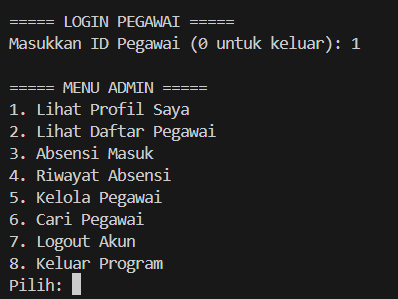
  
  Penjelasan : Login menggunakan id, jika kamu login menggunakan id milik admin maka akan menampilkan menu admin. pada gambar login mengguankan id admin sehingga muncul menu admin yang menapilkan 8 pilihan menu seperti di foto
  
  
  
  Penjelasan : pilih 1. Lihat profil saya, maka akan menapilkan profil pengguna yang sedang kamu gunakan.
  
  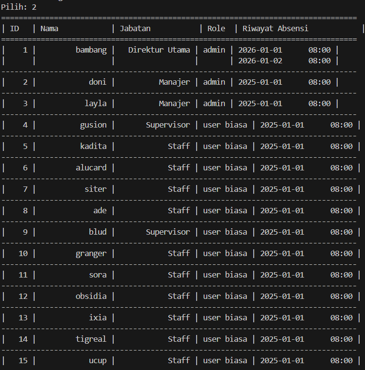
  
  Penjelasan : pilih 2. Lihat daftar pegawai, maka akan menapilkan tabel daftar pegawai.
  
  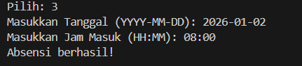
  
  Penjelasan : pilih 3. Absensi, maka akan menapilkan output yang menyuruh kita untuk melakukan input data absensi berupa tahun, bulan , tanggal , dan juga jam masuk , setelah menginputkan akan menampilkan pesan absensi telah berhasil.
  
  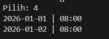
  
  Penjelasan : pilih 4. Riwayat absensi, maka akan menampilkan riwayat absensi dari id yang kita gunakan 
  
  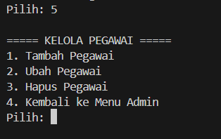
  
  Penjelasan : pilih 5. Kelola Pegawai, maka akan menampilkan menu lagi berupa tambah pegawai, ubah pegawai, dan hapus pegawai
  
  -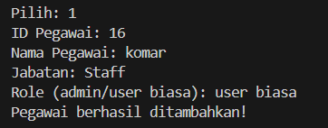
  - tambah pegawai : jika kita pilih 1. tambah pegawai, maka menapilkan output yang menyuruh kita untuk melakukan input data ID, Nama Pegawai, Jabatan, dan Role . setlah menginputkan data maka akan menampilkan pesan pegawai telah berhasil di tambahkan.
    
  - 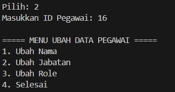 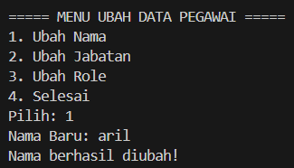 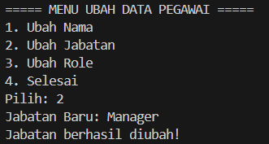 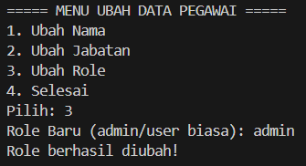
  - ubah pegawai : jika kita pilih 2. ubah pegawai, maka akan menampilkan menu ubah pegawai seperti ubah nama, ubah jabatan, ubah role, dan selesai . misal kita pilih 1 maka kita di suruh menginputkan nama baru dan akan menapilkan pesan update , belaku juga untuk pilihan yang lain.
  
  - 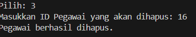
  - Hapus pegawai : jika kita pilih 3. Hapus pegawai,  maka kita di suruh menginputkan id pegawai yang akan di hapus. setelah itu maka akan menapilkan pesan berhasil.
  
  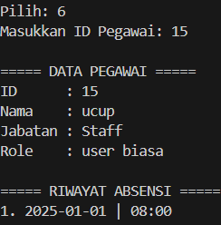
  
  Penjelasan : pilih 6. cari pegawai. maka kita di suruh menginputkan id pegawai yang akan di cari, setelah di inputkann maka akan menapilkan profil dari si pegawainya sendiri dan juga daftar riwayat absensi nya juga.
  
  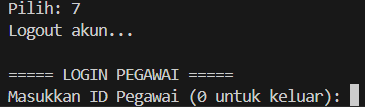
  
  penjelasan : pilih 7. Logout akun. maka  akan kembali ke menu login menggunakan id.
  
  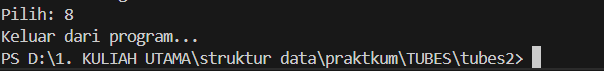
  
  Penjelasan : pilih 8. Keluar program, maka akan mengakhiri progam atau keluar dari progam.


### 7.2 user biasa


## 8. Referensi
1. [Buku atau artikel yang Anda gunakan untuk referensi, jika ada]
2. [Sumber lain yang relevan dengan topik praktikum ini]
